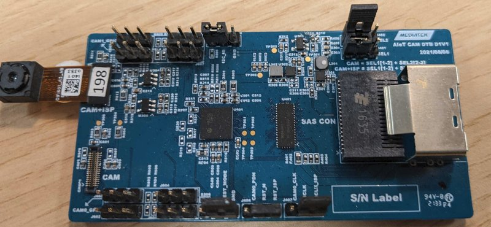
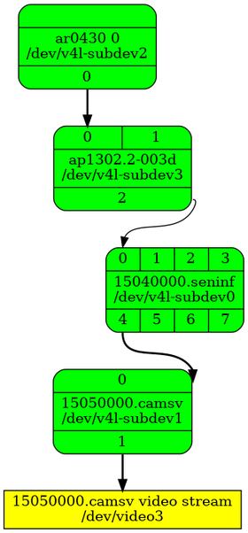

i350 EVK Board
================

The EVK is a development board made by MediaTek.

Building
--------

You can build an image for the Innocomm SB35 board by setting the
`MACHINE` variable in your `local.conf` to `i350-evk`.

.. code::

	MACHINE=i350-evk

For full build instructions, please refer to the top level `README.md`.

DSI Display
-----------

The i350 EVK supports the Startek KD070FHFID015 DSI display.

If you wish to use the DSI display, the related overlay is
`recipes-kernel/dtbo/mt8365-evk/panel-startek-kd070fhfid015.dts`

.. warning::

	Using `panel-startek-kd070fhfid015.dts` requires you to
	plug the DSI display to your board. Failing to connect it will
	prevent HDMI from working. If you only want HDMI, you should
	not use this overlay.

Ethernet and HDMI support
-------------------------

Ethernet and HDMI are sharing the same pins, which means only one is
available at a time.

Ethernet
^^^^^^^^

To use Ethernet, make sure you select the `LAN` feature on the `SW2101` switch.
In addition because Ethernet is disabled by default in the kernel device-tree,
you will also need to load an overlay to enable Ethernet.

If you wish to use Ethernet, the related overlay is
`recipes-kernel/dtbo/mt8365-evk/net-ethernet.dts`

HDMI
^^^^

To use HDMI, make sure you select the `DPI` feature on the `SW2101` switch. By
default HDMI is enabled in the kernel device-tree. Make sure the Ethernet
overlay is not loaded otherwise HDMI would get disabled
(see :ref:`boards/i350-evk:ethernet` section).

MT7663 wireless chipset
------------------------

The i350 EVK board is integrating
a :ref:`platforms/mt7663:MT7663 wireless chipset`.

Device-Tree Overlays (DTBO)
---------------------------

The following Device-Tree Overlays are supported:

* `net-ethernet.dtbo`: Enable support for Ethernet (see :ref:`boards/i350-evk:ethernet` section)

.. _7-inch Raspberry Pi touch display: https://www.raspberrypi.org/products/raspberry-pi-touch-display/

FTDI board control
------------------

The i350 EVK has two FTDI chips connected to the UART0 (CON461) port
and to the UART1 (CON462) port. They are both able to control the
power (PWRKEY), reset (SYSRST), and download (KPCOL0) lines.

+----------------+-------------------+
| FTDI GPIO Line | Function          |
+================+===================+
| 0              | Power (PWRKEY)    |
+----------------+-------------------+
| 1              | Reset (SYSRST)    |
+----------------+-------------------+
| 2              | Download (KPCOL0) |
+----------------+-------------------+

Audio
-----

Playback
^^^^^^^^

By default, the i350 EVK board ouputs audio on the first jack connector (headset) and the second jack (line out) is disabled.

It is possible to switch to the second line. In order to do that, you will need to change several alsa settings using the following commands:

In order to disable the headset output and enable the Line out:

.. prompt:: bash $

	amixer sset -c mtsndcard 'Audio_Amp_L_Switch',0 Off
	amixer sset -c mtsndcard 'Audio_Amp_R_Switch',0 Off
	amixer sset -c mtsndcard 'Speaker_Amp_Switch',0 On

In order to switch back to Headset out:

.. prompt:: bash $

	amixer sset -c mtsndcard 'Audio_Amp_L_Switch',0 On
	amixer sset -c mtsndcard 'Audio_Amp_R_Switch',0 On
	amixer sset -c mtsndcard 'Speaker_Amp_Switch',0 Off

The following command is an example that will start a music playback of a wav file that is already on the device:

.. prompt:: bash $

	aplay playback_file.wav

Capture
^^^^^^^

By default, the i350 EVK board captures audio using the jack microphone.

The following command is an example that will start a mono record with a sampling rate of 48kHz and a signed 32bits bit format:

.. prompt:: bash $

	arecord -c 1 -r 48000 -f s32_le recorded_file.wav

It is possible to record using the 2 PDM mics present on the board instead.
In this case, the device will need to be specified explicitly as follows:

.. prompt:: bash $

	arecord -D dmic -c 2 -r 48000 -f s32_le recorded_file.wav

Another possibility is using the Analog mic also present on the board.
In that case, you will need to switch from the jack mic to the analog mic using the following command:

.. prompt:: bash $

	amixer sset -c mtsndcard 'Audio_MicSource1_Setting',0 ADC1

Then use a similar command as for jack mic:

.. prompt:: bash $

	arecord -c 1 -r 48000 -f s32_le recorded_file.wav

In order to switch back to jack mic, use the following command:

.. prompt:: bash $

	amixer sset -c mtsndcard 'Audio_MicSource1_Setting',0 ADC2

USB audio
^^^^^^^^^

USB audio is supported on this board. Simply plug an USB audio device (an USB headset for example) and check its id or name before playing or recording something.

In order to play a wav file:

.. prompt:: bash $

        # List the playback devices
        aplay -l
        # If USB card id is 1 and its playback device id is 0,
        # using the following command (forcing the framerate
        # to 48HHz)
        aplay -D plughw:1,0 -r 48000 playback_file.wav

In order to record a wav file:

.. prompt:: bash $

        # List the capture devices
        arecord -l
        # If USB card id is 1 and its capture device id is 0,
        # using the following command (forcing the framerate
        # to 48HHz)
        arecord -D plughw:1,0 -r 48000 -c 1 -f s32_le recorded_file.wav

Cameras
-------

The i350_evk board supports the following csi camera configs:

* Single Onsemi AP1302 ISP + AR0430 sensor on CSI0
* Single Onsemi AP1302 ISP + AR0430 sensor on CSI1
* Dual Onsemi AP1302 ISP + AR0430 sensor on CSI0 and CSI1

Based on the necessary config, you need to use the following dtbo:

* camera-ap1302-ar0430-single-csi0.dtbo
* camera-ap1302-ar0430-single-csi1.dtbo
* camera-ap1302-ar0430-dual.dtbo

For example, if you are using CSI0 only, the related overlay is
`recipes-kernel/dtbo/mt8365-evk/camera-ap1302-ar0430-single-csi0.dts`

When flashing the board:

.. prompt:: bash $

        aiot-flash -i rity-demo-image --load-dtbo camera-ap1302-ar0430-single-csi0.dtbo

Hardware Setup
^^^^^^^^^^^^^^

To have the correct hardware setup to work with the AP1302 ISP and AR0430 sensor, please check:

* The position of the jumpers on J501, J502, J401, J402, J403 and J404 should be the same as shown in the image

* The sensor should be connected on CN602 (CAM+ISP) as shown in the image

Media Setup
^^^^^^^^^^^

To configure the media pipeline and access the ISP + sensor, you can use the `media-ctl` application from the v4l-utils package. 

**media-ctl** can be used to print the hardware components that are available to interconnect:

.. prompt:: bash $

        media-ctl -p -d0

You should be able to see the following entities:

* mtk-mdp:m2m-source
* mtk-mdp:m2m-proc
* mtk-mdp:m2m-sink

By running:

.. prompt:: bash $

        media-ctl -p -d1

You should be able to see the following entities:

* 15040000.seninf
* 15050000.camsv
* 15050000.camsv video stream
* ap1302.2-003d
* ar0430

The interconnection of the components must ensure that the links between a source and a link pad have the same format (fmt). Also, the source from sensor AR0430 must have the format `SGRBG12_1X12/2316x1746` and, on camsv, the final sink must be of `UYVY8_1X16/2316x1746` format.

If those rules are not being respected, you can use the command:

.. prompt:: bash $ 

        media-ctl -d /dev/media1 -V "42:2 [fmt:UYVY8_1X16/2316x1746]"

to change the format of an entity:pad.

In addition, all the connexions between the components must be enabled. If there is any which is not, you can use the command:

.. prompt:: bash $

        media-ctl -d /dev/media1 -l "42:2->1:1[1]"

to enable the link between entity:pad_src and entity:pad_sink.

After this setup, the topology for one sensor on CSI0 must be similiar to the one shown in the image:

Listing Cameras
^^^^^^^^^^^^^^^

With the previous setup ok, you can use **cam** command, from libcamera, to list all the cameras connected to the board. If you run the command:

.. prompt:: bash $

        cam -l

the application should find a camera:

.. code::

        Available cameras:
        1: Internal front camera (/base/soc/i2c@11009000/camera@3d)

Previous result was an example with one sensor and one ISP at CSI0.

Frames Capture
^^^^^^^^^^^^^^

With the media setup ok, you should also be able to capture some image frames.

.. prompt:: bash $

        v4l2-ctl --set-fmt-video=width=2316,height=1746,pixelformat=UYVY --stream-mmap=1 --stream-count=10 --stream-to=v4l2_out -d /dev/video3 --verbose

Using the command above, a file named `v4l2_out` should have been created containing 10 frames 2316x1746 with format UYVY. You can then use another tool, such as ffmpeg, to be able to verify the frames. 

.. prompt:: bash $

        ffmpeg -f rawvideo -s 2316x1746 -pix_fmt uyvy422 -i v4l2_out image"%03d.png
