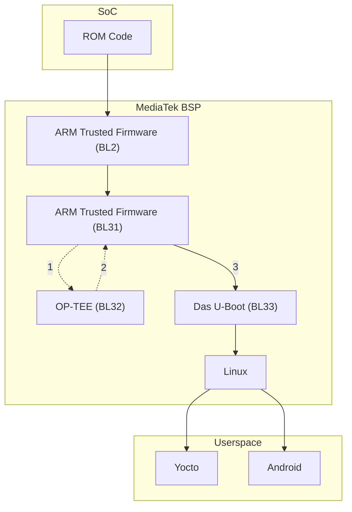

# Boot Architecture

The diagram below describe the boot architecture:

```mermaid
graph TB
	subgraph SoC
		bl1[ROM Code]
	end

	subgraph MediaTek BSP
		bl2["ARM Trusted Firmware (BL2)"]
		bl31["ARM Trusted Firmware (BL31)"]
		bl32["OP-TEE (BL32)"]
		bl33["Das U-Boot (BL33)"]
		linux[Linux]
	end

	subgraph Userspace
		yocto[Yocto]
		android[Android]
	end

	bl1 --> bl2
	bl2 --> bl31
	bl31 -.1.-> bl32
	bl32 -.2.-> bl31
	bl31 --3--> bl33
	bl33 --> linux
	linux --> yocto
	linux --> android
```
